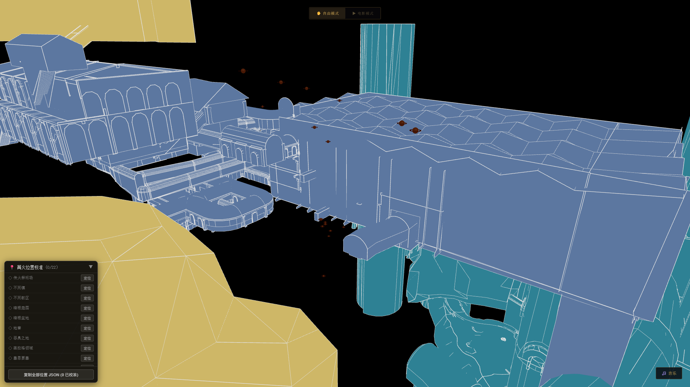
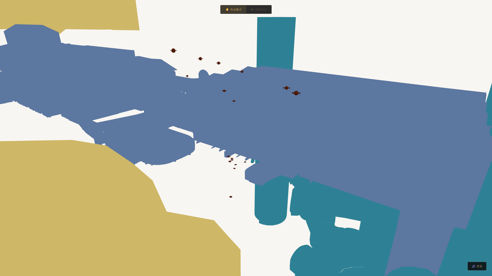
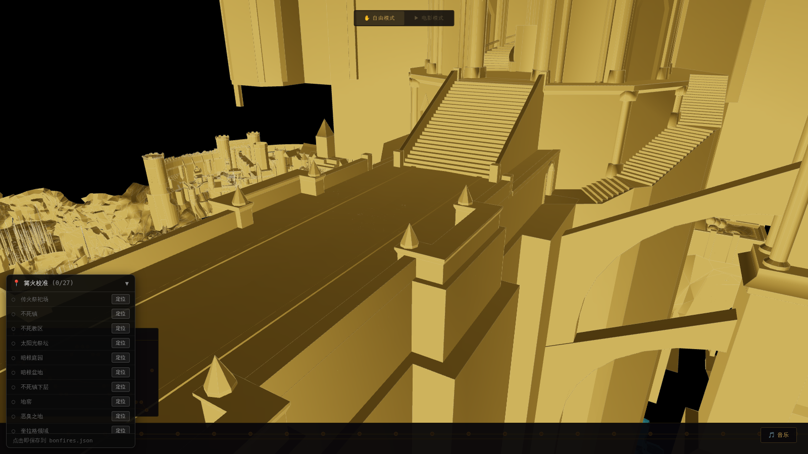
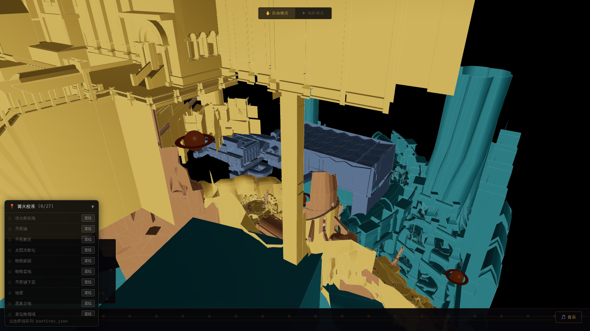
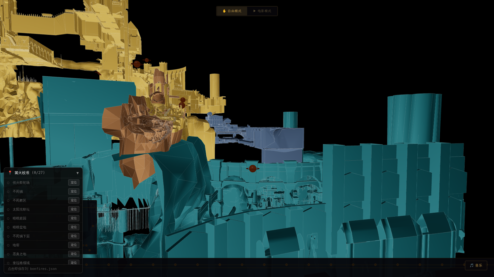
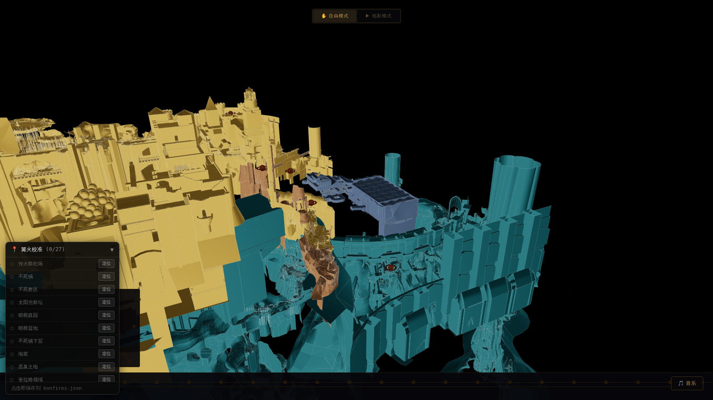

# 罗德兰篝火图谱 · Bonfires of Lordran

> 一个以**篝火**为叙事单元的 Dark Souls 1 交互式 3D 世界图谱。粉丝向，非商业。



---

## Overview

**Bonfires of Lordran** places [9S's Lordran glTF model](https://sketchfab.com/3d-models/) at the center of an interactive visualization. All 27 bonfires serve as narrative nodes — fly through them in **Cinema Mode** or explore freely in **Free Mode**.

Each bonfire carries:
- 200–300 character lore text (Chinese-primary, English proper nouns retained)
- NPC presence list
- Prerequisite / next bonfire graph (rendered as the branch map)
- Cinematic caption quote
- `lore_anchors` tagged by confidence: `canon → consensus → theory → personal`



---

## Features

| Feature | Status |
|---|---|
| glTF Lordran model — black background, white-edge aesthetic | ✅ |
| 27 bonfire markers (ring + pulsing ember + sparkles) | ✅ |
| Cinema Mode — auto-flythrough with lerp interpolation | ✅ |
| Free Mode — OrbitControls | ✅ |
| Sidebar — lore panel, NPCs, lore anchors | ✅ |
| Timeline — bottom bar, 27 clickable dots | ✅ |
| BranchMap — SVG network graph (depth × order) | ✅ |
| Fire sprite animation | 🔲 Phase 5 |
| Spacebar pause in Cinema Mode | 🔲 Phase 5 |
| Bloom / Draco compression / mobile | 🔲 Phase 6 |

---

## Tech Stack

- **Vite** ^5 + **TypeScript** ^5
- **React** ^18 + **React Three Fiber** ^8 + **Drei** ^9
- **Zustand** ^4
- **Three.js** ^0.170+

---

## Getting Started

```bash
npm install
npm run dev        # dev server with HMR
npm run build      # production build → dist/
npm run preview    # preview production build
npx tsx scripts/validate_data.ts   # validate bonfires.json schema
```

The 3D model (`dark_souls_map/scene.gltf` + `scene.bin`, ~69 MB) must be present locally — it is not committed to the repo.

---

## Data

Primary content lives in `src/data/bonfires.json` (27 records) and `src/data/npcs.json` (21 records). Run the validation script before editing:

```bash
npx tsx scripts/validate_data.ts
```

---

## Project Structure

```
src/
├── data/           # bonfires.json, npcs.json
├── scene/          # R3F components (model, markers, camera)
├── ui/             # Sidebar, Timeline, BranchMap, ModeToggle
├── store/          # Zustand store
├── styles/         # global.css (Cinzel + Noto Serif SC)
└── types.ts
```

---

## Dev Log

### Bonfire repositioning + matcap shading

The original `world_position` values were hand-placed in a tight cluster near
the origin and didn't correspond to the model's actual geometry. The 9S glTF
bakes each region into named mesh groups whose vertices already live in world
space, so `scripts/place_bonfires_from_model.py` reads each region's true
bounding box straight from the model and drops every bonfire onto it
(`src/data/region_anchors.json` caches the per-region boxes for reuse). Camera
poses were regenerated to view each bonfire from outside the map looking inward,
and markers were scaled up to stay readable at the model's ~1000-unit span.

The model ships with **no textures and no UVs** (only `POSITION` + `NORMAL`), so
image texturing isn't possible without generating UVs. Instead, surface material
is faked with a procedurally-generated clay/stone **matcap** (no UVs, no external
asset), tinted per elevation band so regions stay distinguishable. Flat color
blocks now show real sculpted depth.

| Anor Londo | Firelink Shrine |
|---|---|
|  |  |
| **Blighttown** | **Duke's Archives** |
|  |  |

---

## Legal

- **9S Lordran model** (`dark_souls_map/`): CC BY-NC 4.0 — attribution required, non-commercial only.
- **Lore text**: paraphrased from wiki sources (Fextralife / Fandom / Wikidot, CC BY-SA). No verbatim reproduction.
- **Game dialogue**: small quotes under fair use only (`lore_anchors`).

See `LEGAL.md` for full details.

---

*Fan project. Not affiliated with FromSoftware or Bandai Namco.*
